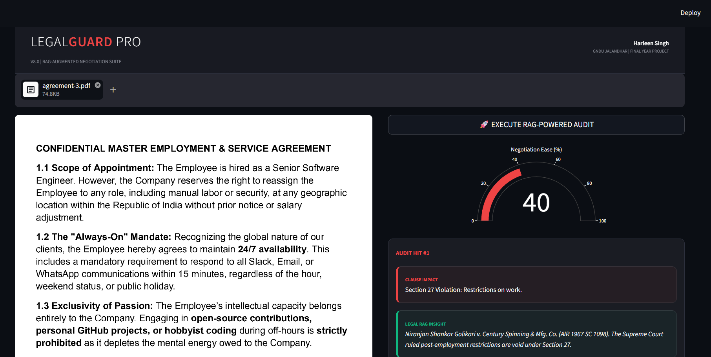

How It Works
The system operates as an automated legal-tech pipeline that transforms complex PDF contracts into actionable insights through the following stages:

Spatial Text Extraction: Utilizing pdfplumber, the engine performs high-precision extraction of both text and its exact coordinates on the document, enabling the system to "see" and highlight specific adversarial lines.

Adversarial Logic Engine: The extracted text is processed through a risk-detection layer that identifies predatory language related to employment bonds, non-compete restrictions, and unconscionable monitoring.

RAG-Powered Legal Context: The system uses Retrieval-Augmented Generation (RAG) to cross-reference identified clauses with the Indian Contract Act (Sections 27 & 74) and fetches real-world High Court precedents to provide law-backed explanations.

Dynamic Risk Profiling: Findings are aggregated into a Contract Health Profile, visualized via a Plotly radar chart, which scores the agreement across four key domains: Privacy, Financial Risk, Fairness, and Career Freedom.

Automated Rebuttal Generation: Based on the detected risks, the tool generates a professional, law-cited protest email that users can immediately use to negotiate fairer terms with HR.